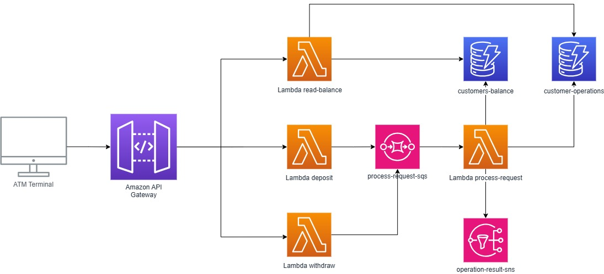

# Welcome to your AWS CDK Python project!

This project is just an AWS minimal Cloud architecture in order to explore basics of Python serverless capabilities.

The architecture used in this example is:

Let's assume that advanced topic are not included intentionally, just like security, costs management, AWS project roles and setups.

Enjoy!
